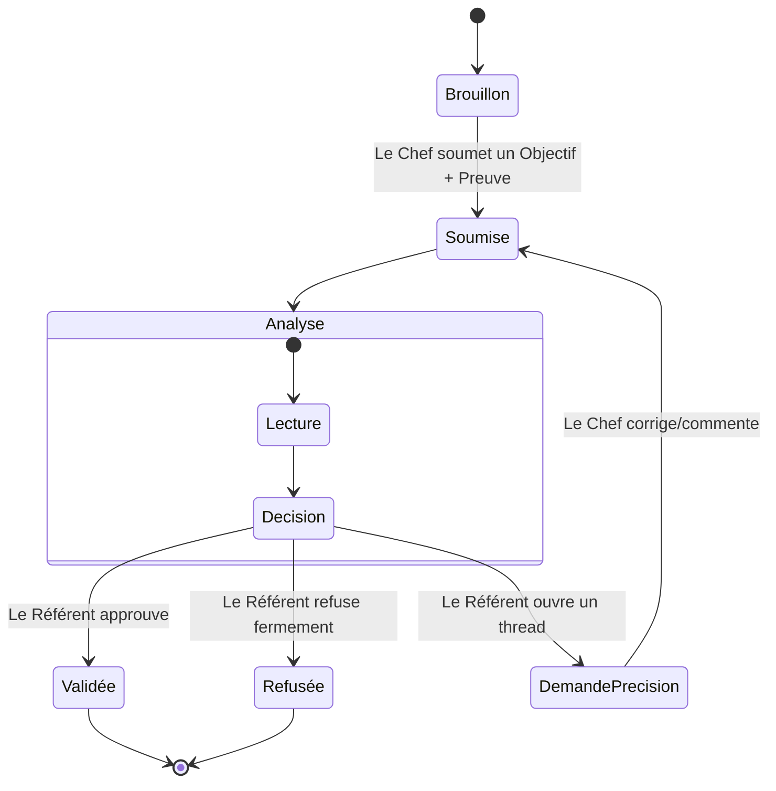
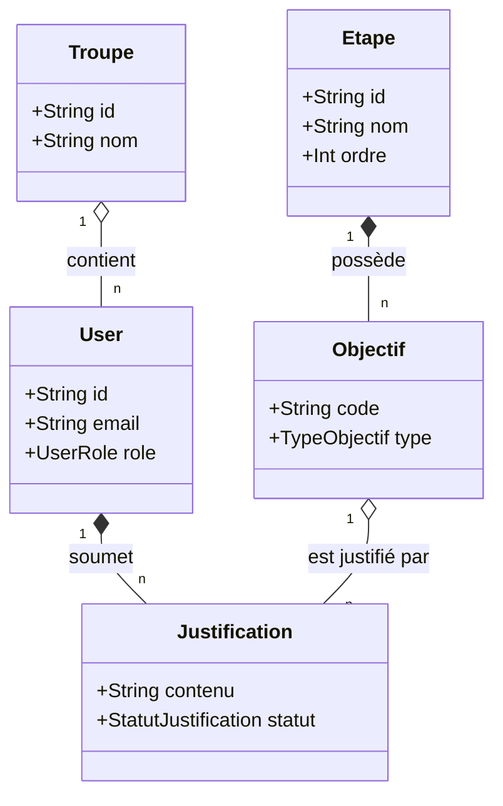
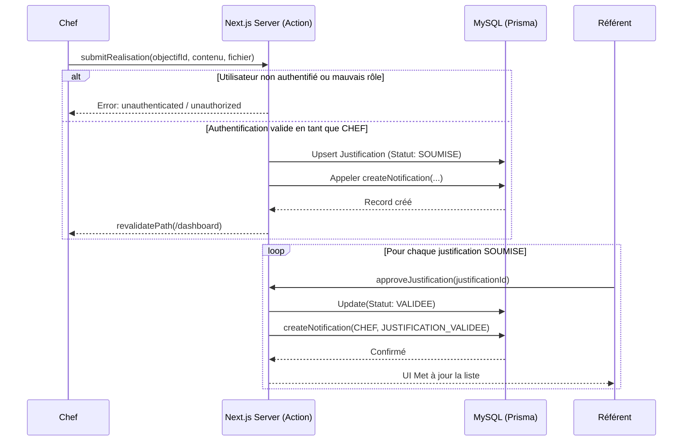

# Cahier des Charges Fonctionnel et Technique : Flambeau Progrès

## PARTIE 1 : CAHIER DES CHARGES FONCTIONNEL

### 1. Contexte et Objectifs
**Contexte :** Le projet "Flambeau Progrès" est une initiative associative bénévole visant à moderniser et digitaliser le suivi pédagogique des Chefs Flambeaux. L'ancien processus, lourd et basé sur des échanges PDF, s'apparentait davantage à du "flicage" et constituait une source de démotivation.
**Objectif de la plateforme :** Offrir une solution web 100% privée, simple et gratifiante, centralisant l'auto-évaluation et la validation des compétences (Objectifs et Réalisations). L'objectif sous-jacent est de documenter l'architecture et le code existant afin qu'il puisse être repris intégralement par un nouveau développeur de manière fluide.
**Problématique chiffrée & ROI Attendus :** Bien que le contexte soit associatif sans contrainte budgétaire stricte (bénévolat), le ROI mesurable réside dans le temps qualitatif gagné par les référents (estimé à un gain de productivité de 50% sur l'étude des dossiers) et l'augmentation de l'engagement des Chefs. Les variables de succès cibles incluent le taux d'adoption de la plateforme et la diminution du temps de cycle de validation.

### 2. Acteurs et Personas
Le système est privé et régi par un contrôle d'accès strict (RBAC).
*   **Le Chef (Animateur) :** Utilisateur principal. S'auto-évalue, soumet des textes et des fichiers pour justifier sa progression.
*   **Le Référent :** Formateur ou validateur. Étudie les soumissions d'une Troupe ou d'une Étape, valide/refuse et effectue la revue finale.
*   **L'Administrateur :** Paramètre le système, gère les Troupes, le mapping des Étapes et les assignations système `EtapeReferent`.

**Matrice RACI Générale :**
| Tâche / Phase | Admin | Référent | Chef | Système (Automatisation) |
| :--- | :---: | :---: | :---: | :---: |
| Gérer les Troupes et Comptes | A/R | I | I | C |
| Soumettre une Justification | I | C | A/R | - |
| Valider une Réalisation | I | A/R | C | - |
| Envoyer Notification Validation | - | I | I | A/R |
*(R = Réalise, A = Approuve, C = Consulté, I = Informé)*

### 3. Périmètre Agile
**Epic 1 : Espace Chef (Progression et Soumission)**
*   *US 1.1 :* En tant que Chef, je peux renseigner une compétence (texte) pour l'auto-valider.
    *   *Critères d'acceptation :* Le statut passe à `AUTO_VALIDEE`. Aucune notification n'est envoyée.
*   *US 1.2 :* En tant que Chef, je peux lier un fichier à une réalisation pour soumettre une preuve.
    *   *Critères d'acceptation :* Le fichier est persisté. L'objectif passe en `SOUMISE`. Une notification `NOUVELLE_JUSTIFICATION` est générée à l'attention du Référent de l'Etape.

**Epic 2 : Espace Référent (Validation et Feedback)**
*   *US 2.1 :* En tant que Référent, je peux voir la liste des soumissions en attente sur mon Étape assignée.
    *   *Critères d'acceptation :* La vue est filtrée sur l'entité `Justification` avec le statut `SOUMISE` et sur l'`etapeId` lié aux `EtapeReferent` de la session.
*   *US 2.2 :* En tant que Référent, je peux approuver ou refuser une justification avec un motif précis.
    *   *Critères d'acceptation :* Le statut passe en `VALIDEE` ou `REFUSEE`. Création d'une entité `Commentaire` (Optionnel). Notification descendante au Chef.

### 4. Contraintes
*   **Budget et Délais :** Projet bénévole. Coûts d'infrastructure "Run" limités au strict minimum (tiers gratuits Vercel, PlanetScale/Railway, MySQL managé). Délai de production dit en "Best effort".
*   **Cadre Légal (Privacy by Design) :** L'application traite des données de membres d'association. Fonctionnellement, le système intègre la minimisation des données (Privacy by Default). Les mots de passe sont hashés en bcrypt via Auth et l'architecture respecte les directives du RGPD quant au droit à l'effacement en proposant des relations de suppression en SQL (Cascade delete pour les dépendances des `User`).

---

## PARTIE 2 : CAHIER DES CHARGES TECHNIQUE

### 5. Architecture Globale
Le choix d'ingénierie s'est porté sur un **Monolithe Modulaire** exploitant **Next.js 15 (App Router)** couplé à l'ORM **Prisma**.
*   **Justification du Pattern :** Contrairement à une architecture en Microservices (overkill et antipattern pour la volumétrie) ou à une SPA isolée (React pur + API Express séparée), le Monolithe Next.js unifie la couche serveur (RSC, Server Actions) et le Front. Cela réduit drastiquement la dette technique d'infrastructure (hébergement unique) et simplifie extrêmement la passation à un nouveau développeur qui n'a qu'un seul repository à appréhender avec une logique TypeScript complète (End-to-End type safety).

### 6. Grille d'Évaluation Unifiée

Le choix des briques a fait suite à une étude comparative des ROI de maintenance (Noté de 1 à 5).

| Technologie / Stack | Performance | Coûts (FinOps) | Conformité/Sécurité | Maintenabilité | Total (/20) |
| :--- | :---: | :---: | :---: | :---: | :---: |
| **Monolithe Next.js (Server Actions) + Better Auth** | 5 | 5 | 4 | 5 | **19/20** |
| *Alternative: SPA CSR + NodeJS JWT API* | 4 | 4 | 4 | 3 | *15/20* |
| **MySQL Relationnel + Prisma (Choix retenu)** | 4 | 5 | 5 | 5 | **19/20** |
| *Alternative: MongoDB (NoSQL) Mongoose* | 4 | 5 | 3 | 3 | *15/20* |

### 7. Infrastructure et Base de Données
*   **Modèle Relationnel :** L'ORM **Prisma** assure le typage strict et les migrations sur la BDD **MySQL**. La rigidité d'un Schéma Relationnel certifie la cohérence métier des entités interdépendantes (`Users` / `Troupes` / `Etapes` / `Justifications` / `Commentaires`).
*   **Infrastructure et CDN :** Le front et les endpoints Auth tournent en mode Serverless sur plateforme optimisée Vercel. Les Fichiers (preuves des Chefs) utilisent la table logicielle `Fichier` interfacée avec un bucket externe pour préserver le disque ou BLOB Vercel.
*   **FinOps :** Stratégie tournée à 100% vers les instances mutualisées ou Free Tiers pour maximiser la liberté financière de l'association.

### 8. Sécurité et Juridique
*   **RBAC et Authentification :** L'identité et les accès sont gérés par **Better Auth**. Création de `Sessions` basées sur un token opaque (ou JWT).
*   **Contrôle Middlewares et Mutations :** Chaque **Server Action** comporte un garde protecteur (`if (!session || role !== 'ADMIN')`) garantissant que la couche GraphQL/API est hermétique aux élévations de privilèges (Insecure Direct Object Reference).

### 9. Modélisation UML

#### A. Diagramme des Cas d'Utilisation
```mermaid
usecaseDiagram
    actor Chef
    actor Referent
    actor Admin

    usecase "S'authentifier" as Auth
    usecase "Soumettre Justification" as Submit
    usecase "Uploader Preuve" as Upload
    usecase "Valider/Refuser Soumission" as Validate
    usecase "Gérer Troupes & Admin" as Manage

    Chef --> Submit
    Submit .> Auth : <<include>>
    Submit <.. Upload : <<extend>> (Si Type=REALISATION)
    
    Referent --> Validate
    Validate .> Auth : <<include>>
    
    Admin --> Manage
    Manage .> Auth : <<include>>
```

#### B. Diagramme d'Activité (Cycle de Justification)


#### C. Diagramme de Classes (Coeur Prisma Métier)


#### D. Diagramme de Séquence (Avec conditions `alt` et boucle)


### 10. Qualité et Tests
*   **Stratégie :** La pyramide de test donne la priorité à l'hygiène du socle TypeScript. Une dépendance forte au Server Rendering (RSC) minimise le besoin de tester le DOM (Vitest) et recentre vers des tests e2e (Playwright) et du typage strict statique.
*   **Tableau de Tests Concrets (Cas nominaux et aux limites) :**

| Fonctionnalité | Scénario évalué | Préconditions | Données insérées | Résultat Attendu |
| :--- | :--- | :--- | :--- | :--- |
| `submitRealisation` | Interdire l'action par un autre rôle | User est mocké en REFERENT | payload PDF 1Mo | Erreur `UnauthorizedException` |
| `approveJustification` | Validation d'un process complet | DB: `Justification` status=SOUMISE | `justificationId` en BD | M-à-J Statut=`VALIDEE` + `Notification` |
| Calcul `Dashboard` | Affichage 100% de progression | Array contenant 1x AUTO_VALIDEE et 1x VALIDEE | N/A | Composant retourne barre verte 100% |

*   **Extrait TDD (Logique unitaire) :**
```typescript
import { test, expect } from 'vitest';
import { calculateProgress } from '@/utils/progress-engine';

test('Doit retourner 100% d\'avancement si la liste valide est pleine', () => {
  const justificationsValides = [
    { type: 'COMPETENCE', statut: 'AUTO_VALIDEE' },
    { type: 'REALISATION', statut: 'VALIDEE' }
  ];
  const targetObjectifsTotalSize = 2; // Le total métier attendu
  const progress = calculateProgress(justificationsValides, targetObjectifsTotalSize);
  expect(progress).toBe(100);
});
```

### 11. Déploiement et Green IT
*   **Déploiement Continu :** L'environnement de CI est pilotable par la branche `main` du dépôt Git. Le build `npm run build` incorpore systématiquement un TSC Check strict pour repousser tout code cassé en production.
*   **Matrice des Risques :**

| # | Risque identifié | Catégorie | Prob. | Impact | Actions de Mitigation Préventives (Humaines/Tech) |
| :--- | :--- | :--- | :---: | :---: | :--- |
| 1 | **Turn-over du développeur principal** | Humain | ***Élevée*** | **Critique** | **Présence de ce présent CDC, forte utilisation des conventions standards du framework Next.js 15, Codebase monorepo lisible.** |
| 2 | Engorgement du disque avec les médias | Tech | Modérée | Modéré | Mise en place d'une compression image client-side avant soumission et limitation PDF < 5mo. |
| 3 | Fuite de JWT Secrets | Sécurité | Faible | Majeur | Audit régulier des `ENVIRONMENT_VARIABLES`. Pas de secret stocké "en clair" sur Github. |

*   **Green IT et Numérique Responsable :**
    - Architecture Vercel limitant la dépense CPU via le cache Route Handler. Les pages qui ne mutent pas sont rendues de façon statique.
    - Économie carbone client via un design UI sombre/épuré (Minimalisme CSS via Tailwind limitant les requêtes).
